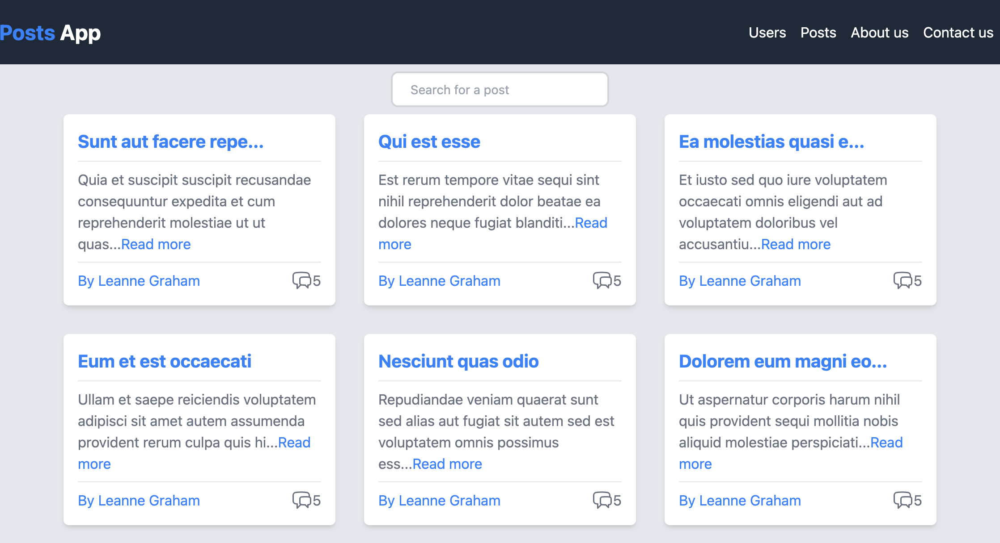
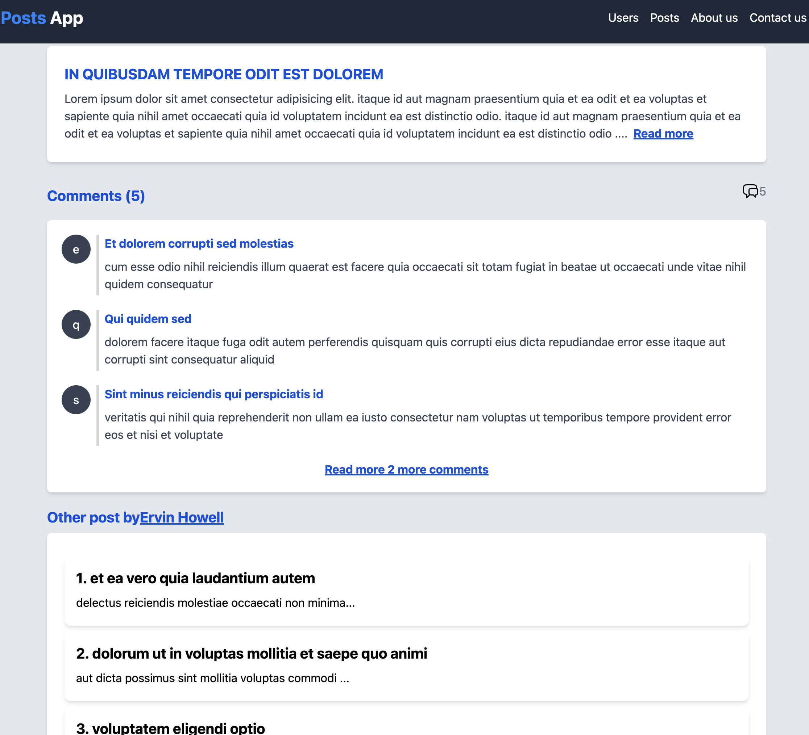
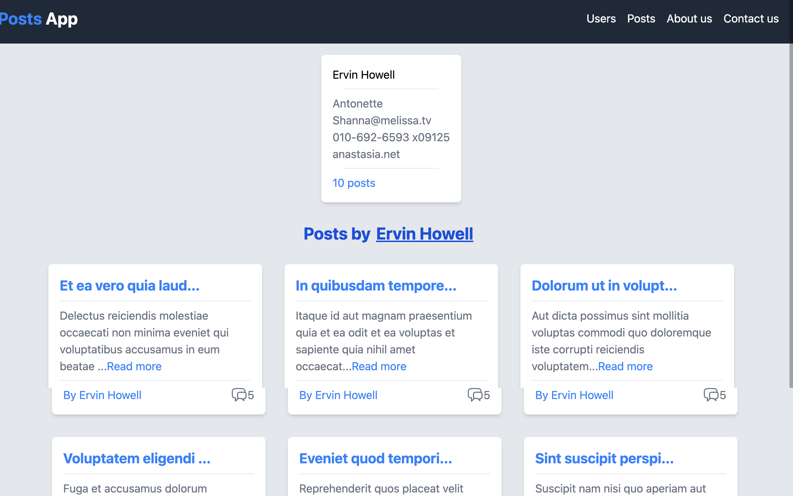

# Frontend React Project - Posts

This is an extra and optional React project to improve your skills with React. It is a simple project that allows you to create posts and view them. It is a good project to practice your skills with React and Redux.

## Instructions

### General

Fork this repo, then clone the **fork** to your machine and start working on it. You can open a pull request as soon as possible (no need to wait until finished)
For styling, you can use whatever css solution you want: css, scss, Material UI, etc.
You need to install the css library yourself.

### Step 1

- Fetch all the posts and return the data from [JSONPlaceholder](https://jsonplaceholder.typicode.com/posts)

- Given a post name as argument, returns the data about that post and user. If the postor user doesn't exist, return an error message.

### Step 2

- Render the data of all the posts and users (from Step 1). you can use any css library you want (css, scss, Material UI, etc.)
- Make sure to split the component into smaller components (e.g. Post, PostList, etc.)

### Step 3

- Integrate react router into your project and create atleast 2 pages:
  - `HomePage`: renders the list of posts
  - `UsersPage`: renders the list of users (you can fetch the data from [JSONPlaceholder](https://jsonplaceholder.typicode.com/users))
  - `singleUserPage`: renders specific user data and their posts
  - `PostPage`: renders the details of a post (title, body, comments)

### Step 4

- Set up all the redux boilerblate for the project
- Everything related to redux stays in one folder: reducers, store
- Think about what reducer you're going to make and write them accordingly
- Move the state that contains all posts, users and comments to redux store

### Step 5

Take your time to implement the following features:

- Add a button to the `HomePage` that allows you to add a new post
- Add listing of of nested resources (comments) to the `PostPage`
- Add more features and make the project look good. You can use any css library you want (css, scss, Material UI, etc.)

## References

Homepage:

Users page:

Single Post page:

Single User page:

